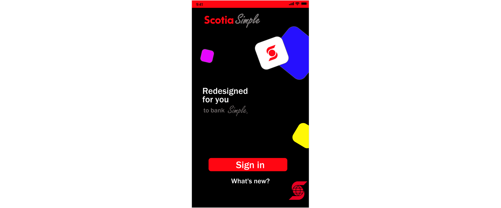
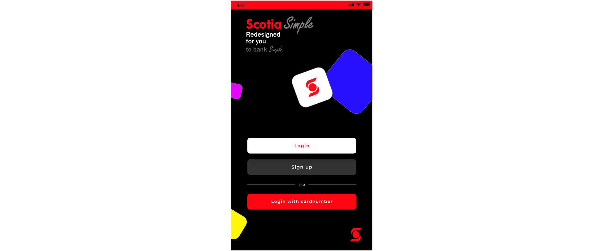
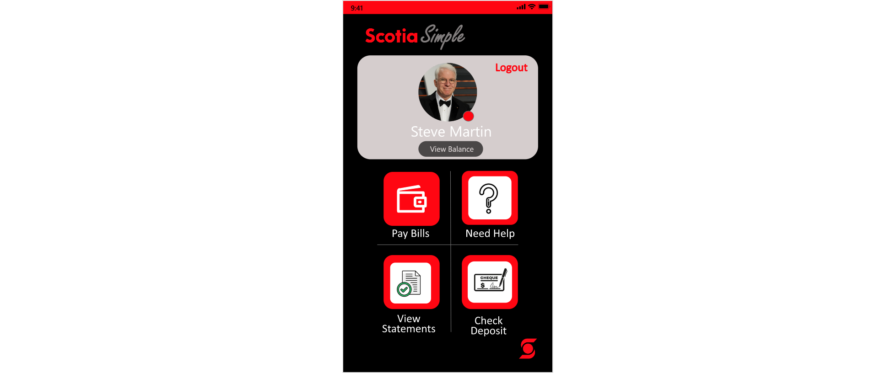

# Scotiabank-Hackathon-Project-2021
2021 Scotiabank Hackathon S:/HACKS. 
The problem given for the Hackthon was "Improve accessibility to online financial services and minimize the digital divide in our society, as our technology rapidly advances".
The event was held online, and the participants were given less than 48 hours to come up with a solution.

ScotiaSimple
------------
ScotiaSimple app was designed using Adobe XD. My main goal was to make a 'lite' version of the official Scotiabank App, which can be used by people in remote locations, where the network is not strong enough i.e. 2G and 3G. This would help people in the remote regions connect with online financial servies. 
I also wanted to make the app as simple to use as possible, since my ultimate goal was to reduce the digital divide, ex. Help Older Citizens connect with the financial world. 

The app is well designed and prototyped using Adobe XD. The project was checked and appriciated by the Tech Team at ScotiaBank, who felt the idea and design were wonderful.

view the project here:
https://xd.adobe.com/view/a32492a5-a3d4-4701-9167-6f916bb00376-f677/

# Images
<table>
  <tr>
    <td>  </td>
    <td>  </td
    <td>  </td>
   </tr>
</table>  

